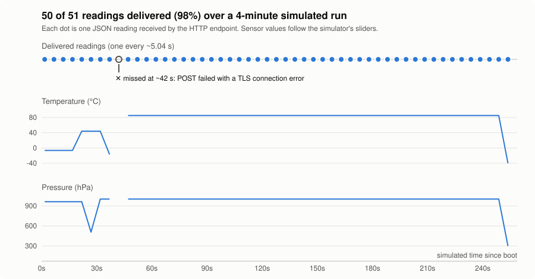
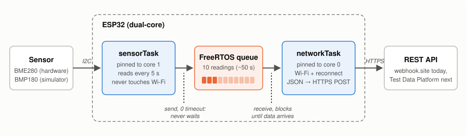
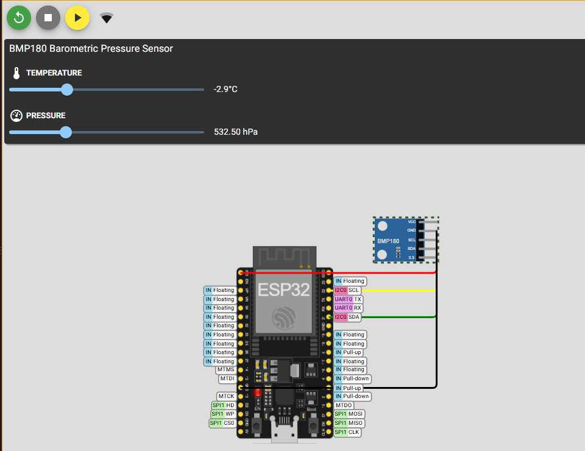
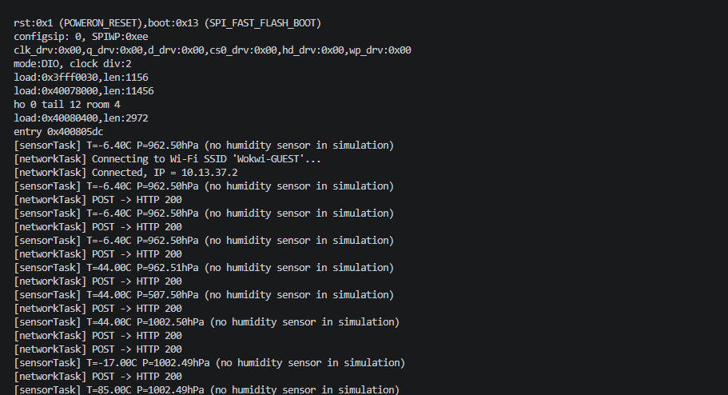
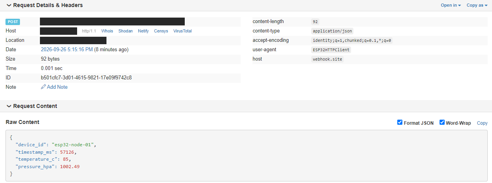
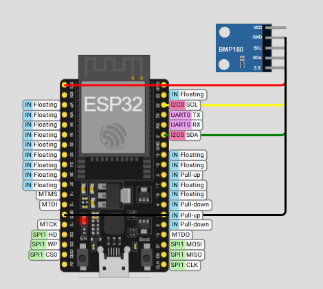

# ESP32 Wireless Sensor Node

FreeRTOS firmware for an ESP32 that reads an environmental sensor over I2C and
streams each reading as JSON to a REST API over Wi-Fi. Sampling and networking
run as two tasks on separate CPU cores, joined by a queue, so a slow or failed
upload never delays the next sensor reading.

**Stack:** C++, FreeRTOS, ESP32 (Arduino framework), I2C, Wi-Fi/HTTPS,
ArduinoJson, PlatformIO, Wokwi simulator



## Why this design matters

The simplest firmware for this job is a single loop: read the sensor, POST it,
wait, repeat. The problem is that network calls are slow and unpredictable. A
Wi-Fi reconnect or a slow server can take seconds, and during that time the loop
isn't sampling, so readings arrive late or get skipped.

This project separates the two jobs:



- **sensorTask** (core 1) reads the sensor every 5 s and hands the reading to a
  queue with a zero timeout. It never waits on the network. If the queue is ever
  full, it drops that reading and keeps sampling on schedule.
- **networkTask** (core 0) blocks on the queue, keeps Wi-Fi connected, and POSTs
  each reading as JSON over HTTPS.
- **The queue** holds up to 10 readings (~50 s), which absorbs network hiccups
  without the sensor side ever noticing.

## Demo

Tested in the [Wokwi](https://wokwi.com) ESP32 simulator, which emulates the real
ESP32 chip, its I2C bus, and Wi-Fi with real internet access.

Simulated circuit, with sensor values set by the sliders:



Serial output, with both tasks running and each reading followed by its POST:



Each reading arriving at a live HTTP endpoint (webhook.site; IP and URL
redacted):



## Results

In a continuous ~4-minute simulated run, the node took **51 readings and
delivered 50 (98%)**, every one with a valid JSON body:

```json
{ "device_id": "esp32-node-01", "timestamp_ms": 57126, "temperature_c": 85, "pressure_hpa": 1002.49 }
```

- Readings were sampled every ~5.04 s, with no gaps other than the one below.
- The single missed reading (at ~42 s) was a POST that failed with a TLS
  connection error. The firmware logged it and carried on, and sampling was
  unaffected. The next POST succeeded. Retrying failed POSTs is the first item
  under [Future work](#future-work).
- Moving the simulator's sliders changed the values arriving at the endpoint,
  confirming the data is read live over I2C rather than hard-coded.

**Validation status**

- [x] Runs in simulation: tasks start, readings log to serial, the queue hands
      data from sensorTask to networkTask
- [x] Real HTTP POSTs leave the simulator and reach a live endpoint (50 of 51)
- [ ] Runs on real hardware with a physical BME280 (adds humidity)
- [ ] Survives real Wi-Fi drops without crashing
- [ ] Readings land in the Engineering Test Data Platform's database

## Running it

Requires [PlatformIO](https://platformio.org) (VS Code extension or CLI).
Copy `include/config.h.example` to `include/config.h` and set your Wi-Fi
credentials and `API_ENDPOINT_URL`. `config.h` is git-ignored.

**In the simulator** (no hardware needed). Wokwi has no BME280 part, so the
`esp32dev-sim` build swaps in a BMP180 (temperature and pressure, no humidity):

1. Set `WIFI_SSID` to `"Wokwi-GUEST"` and `WIFI_PASSWORD` to `""`.
2. Build: `pio run -e esp32dev-sim`
3. In VS Code with the Wokwi extension: F1 → **Wokwi: Start Simulator**. Serial
   output appears in the Terminal panel.

**On hardware** (ESP32 DevKitC + BME280 breakout):



| ESP32 | BME280 |
|---|---|
| GPIO 21 | SDA |
| GPIO 22 | SCL |
| 3V3 | VCC |
| GND | GND |

```
pio run --target upload
pio device monitor
```

<br clear="right">

## Future work

- **Retry failed POSTs with backoff** instead of dropping them, which would have
  recovered the one missed reading above.
- **Run on physical hardware** with a BME280 to add humidity and confirm
  real-world Wi-Fi reconnect behaviour.
- **Connect to the Engineering Test Data Platform** by adding an endpoint that
  stores readings in a `sensor_readings` SQL table.
- **Verify TLS certificates and add API authentication.** The firmware currently
  encrypts traffic but doesn't verify the server's certificate.
- **Longer soak test** against an endpoint without a request cap (webhook.site's
  free tier stops at 50 requests).
- **Exact 5 s cadence** by switching `vTaskDelay` to `vTaskDelayUntil`, removing
  the ~40 ms drift per cycle.

## Project structure

```
include/config.h.example   Settings template: Wi-Fi, API URL, pins, sample rate
src/main.cpp               Firmware: sensorTask + networkTask
platformio.ini             Build envs: esp32dev (BME280) and esp32dev-sim (BMP180)
wokwi.toml, diagram.json   Wokwi simulator config and virtual circuit
docs/images/               README images and diagrams
```
